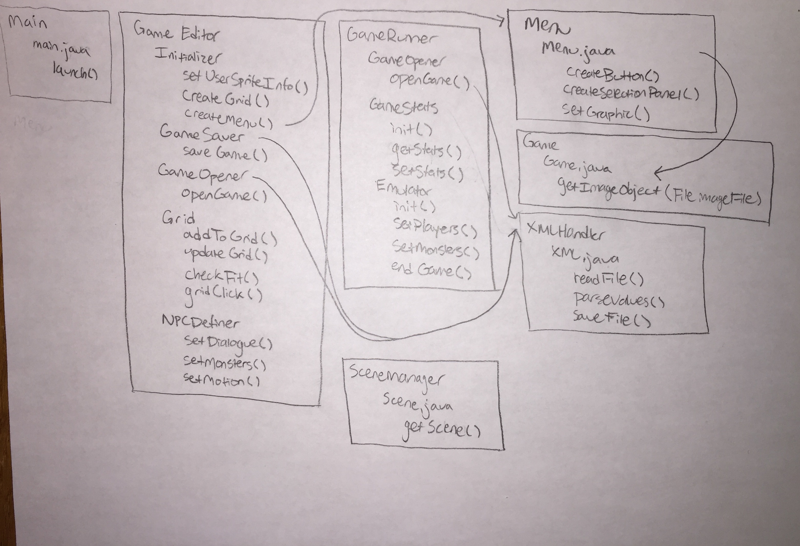

#Plan.md

Robert Steilberg | rhs16
Filip Mazurek | fjm7
Ryan Anders | dra17
Daniel Chai | dhc10
Pim Chuaylua | pc131
Teddy Franceschi | ttf6
Harshil Garg | hg75
Aninda Manocha | am548
Filip Mazurek | fjm7
Robert Steilberg | rhs16
Nisakorn Valyasevi | nv23
William Xiong | wwx

# Design
====================

### Front end responsibilities:
1. Handling placing the ui.scenes.controller.editor.objects on the model.grid (user interaction)
  * Menu that is easy to search for various ui.scenes.controller.editor.objects ranging from obstacles to NPCs
  * If certain ui.scenes.controller.editor.objects need to be user defined, popup box prompts user to enter necessary information
2. Be able to load a world and edit it using the same tools as building it.
3. Defining user model.interactions
  * Chat dialogues
  * Take user input for settings, e.g. name, world name
4. Have a table view of all characters, during the game play
5. Handle scene transitions between exploring and battling (vice versa)
6. Handle animations

### Back end responsibilities:
* Handling placing ui.scenes.controller.editor.objects on the model.grid (backend representation)
* Object behaviors (obstacle, decoration, model.interactions, etc.) and their model.interactions
* Interactions defined in separate classes
* Saving / loading
* Loading separate user files
* Game controller.engine: handling front end input
* Handing off the state, current display as a result of the actions (what to give for rendering)
* Tweaking model.interactions
* Switch between and define different scenes


## Interfaces

###Front end (see )
* GameEditor
  * Initializer.java
    * setUserInfo()
    * createGrid()
    * createMenu()
  * GameSaver.java
    * saveGame()
  * GameOpener.java
    * openGame()
  * Grid.java
    * addToGrid()
    * updateGrid()
    * checkFit()
    * gridClick()
  * NPCDefiner.java
    * setDialogue()
    * setMonsters()
    * setMotion()
* GameRunner
  * GameOpener.java
    * openGame()
  * Stats.java
    * init()
    * getStats()
    * setStats()
  * Emulator.java
    * init()
    * setPlayers()
    * setMonsters()
    * endGame()
* Menu
	* Menu.java
    * createButton()
    * createSelectionPanel()
    * setGraphic()
* Game
	* GameObj.java
    * getImageObject(File imageFile)
* SceneManager
  * Scene.java
    * getScene()

###Back end
* Player
  * getInventory()
  * getBattleHistory()
  * move()
  * getLocation()
  * getStatus()
  * getInteractionHistory()
* Status
  * getInfo()
* WinCondition
  * isSatisfied()
* Game
  * getGrid()
* Grid
  * isInBounds()
  * getWidth()
  * getHeight()
* Block: any model.block in the model.grid
  * getRow()
  * getCol()
  * getBlockState()
  * hasPlayer()
* Interaction
  * getMessage()
* Battle mode: for different game modes, such as battle and walkaround
  * getModeType()
* Item: for different items to be used by the model.player
  * useItem()
* GameInstance
  * getScore()
  * getPlayer()
  * savePlayer()
  * loadPlayer()
  * getGameStatus()
  * resetPlayer()
* GamePlayer
  * playGame(String name)
  * removeGame(String name)
  * getGames()
* DataSaver: for saving the game state to a XML file
  * saveGame()
* DataReader: for loading a game state from a XML file
  * getGame(String name)


Classes:
* SceneManager: for managing scene switching between the Overworld and a Battle
  * switchToOverworldScene()
  * switchToBattleScene()
* OverworldScene
* BattleScene
* Grid: representing the model.grid of Blocks
  * getBlock(Point p)
* Grass (implements Block)
* House (implements Block)
* Pokeball (implements Item)
* Potion (implements Item)


##Use Cases
1. Allow the users can zoom in and zoom out the map
2. Allow the users can upload their own jpg/png/gif files, specify the object types and add those elements into the map
3. Allow the users to use the scrollbar to go through the map
4. Allow the users to change the model.grid position of the ui.scenes.controller.editor.objects already in the map by dragging
5. Allow user to toggle through different background images for the game environment
6. Have GIFs for animated characters
7. Drag enemies to battle to overworld
8. Choose weapon type, with varying levels of strength
9. Drag tree object to the overworld
10. Set the dialogue for a person
11. Select which monster a person will have
12. Define properties for the user’s sprite
13. Player character interacts with a switch
14. User wants to create a win condition based on Player location
15. User wanoieves new highscore
17. Transition between different scenes, such as map and battle scene.
18. Define model.player’s items and their model.interactions, such as potions, etc.
19. Allow user to change attributes of different items dynamically, such as hp, speed, etc.
20. Allow user to create items with default values and attributes
21. User wants to change the type of interaction an object has (e.g. walk through what is normally an obstacle)
22. Player wins the game based on interacting with an NPC
23. User wants to edit the image sprite of a particular monster
24. User wants to connect an area to another area (after designing two areas, setting something like a teleportation point)
25. Add character: select character type (image) and moves/attributes
26. Load previous game
27. Save current game
28. Select game attributes: instructions, splash screen, level bonuses
29. Allow user to create the world by specifying the state for every model.block
30. Allow user to create the world by specifying the states for only a few blocks and have every other model.block default to a certain state
31. Select which blocks a character can walk on and which are off-limits
32. Edit a particular (previously-defined) monster's health
33. Click on tab to toggle through object types
34. Click on save to save map to an XML
35. Select a bunch of cells and add an object to them simultaneously
36. Load map from file directory
37. Designate a new object with a selected image which has certain functionality
38. Define different types of person characters which have defined abilities (like attack speed, attack damage, magic damage, magic resist, other playable attributes)
39. Talk to a NPC that will trigger a battle
40. Click and dragging will highlight numerous blocks to be selected

## Code examples

###Case 1: Front end: placing an object ( a tree ) on the selected location
```
//Backend function
node.setOnAction((event) -> nodeClick(node))
updateButton.setOnAction((event) -> editGrid(selectedObject))
public void editGrid (String type) {
        for (int i = 0; i < nodesSelected.size(); i++) {
            nodesSelected.get(i).setType(type);
            nodesSelected.get(i).setImage(new Image("src/pictures/"+type+".png"));
        }
    }

  public void nodeClick (GridNode clicked) {
        if (nodesSelected.contains(clicked)) {
            nodesSelected.remove(clicked);
        }
        else {
            nodesSelected.add(clicked);
        }
    }
```

###Case 2: Front end: hanging background
```
public void changeBackground(ImageView newView){
	for (int i = 0; i < model.grid.length; i++) {
		for (int j = 0; j < model.grid[0].length; j++) {
			model.grid[i][j].setBlock(new Block(newView));
		}
	}
}
```

###Case 3: Front end: llow the users can upload their own jpg/png/gif files
```
//A part of createButton() method in Menu
Public void init() {
	...
	loadButton = new Button();
	loadButton.setOnAction(new EventHandler<ActionEvent>(){

FileChooser fileChooser = new FileChooser();
	File selectedFile = fileChooser.showOpenDialog(stage);
	gameEditor.addObject(selectedFile);
})
}

//a method in GameEditor class
Public void addObject(File file){
	objectList.add(new Image(file));
}
```

###Case 4: Back end
```
// a method in DataReader class
public void loadGame(File file) {
this.game=loadFile(file);
}
```

###Case 5: Back end
```
//reset model.player to default- GamePlayer class
public void resetPlayer(){
	this.model.player = new Player();
}
```
